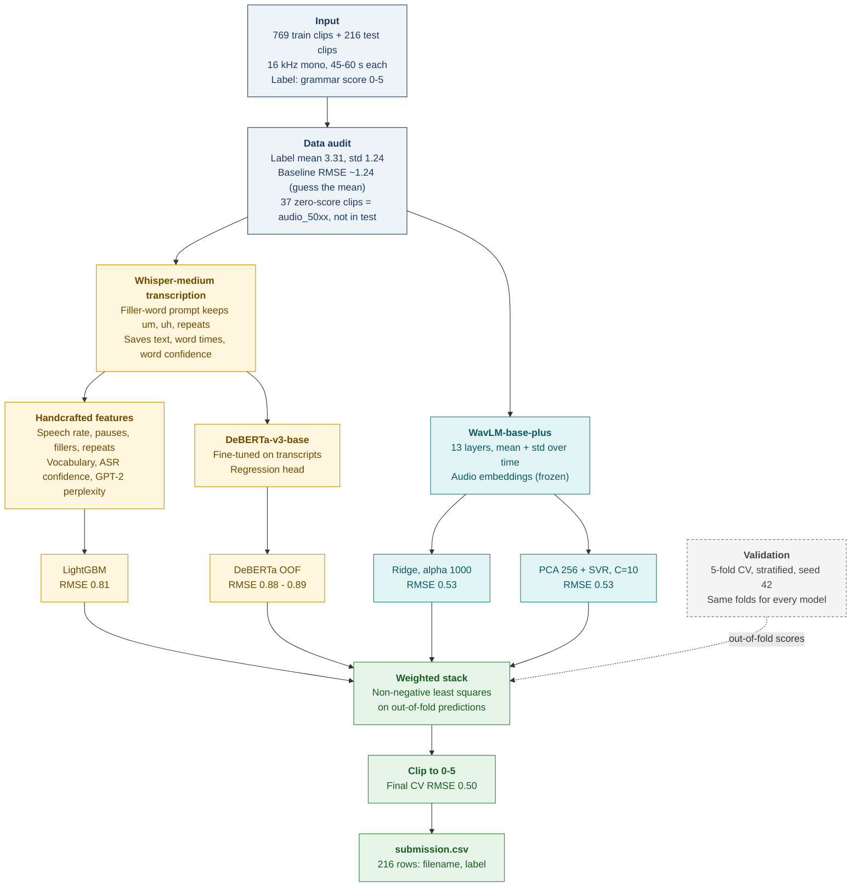
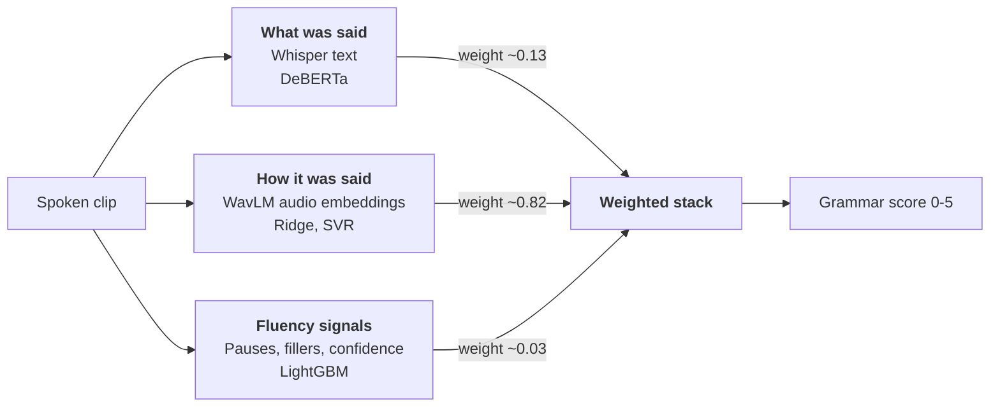
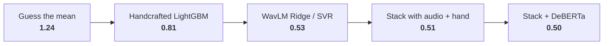

## Pipeline overview

```mermaid
flowchart TD
    A["<b>Input</b><br/>769 train clips + 216 test clips<br/>16 kHz mono, 45-60 s each<br/>Label: grammar score 0-5"]
    A --> B["<b>Data audit</b><br/>Label mean 3.31, std 1.24<br/>Baseline RMSE ~1.24 (guess the mean)<br/>37 zero-score clips = audio_50xx, not in test"]

    B --> C["<b>Whisper-medium transcription</b><br/>Filler-word prompt keeps um, uh, repeats<br/>Saves text, word times, word confidence"]
    B --> D["<b>WavLM-base-plus</b><br/>13 layers, mean + std over time<br/>Audio embeddings (frozen)"]

    C --> E["<b>Handcrafted features</b><br/>Speech rate, pauses, fillers, repeats<br/>Vocabulary, ASR confidence, GPT-2 perplexity"]
    C --> F["<b>DeBERTa-v3-base</b><br/>Fine-tuned on transcripts<br/>Regression head"]

    E --> G["LightGBM<br/>RMSE 0.81"]
    D --> H["Ridge, alpha 1000<br/>RMSE 0.53"]
    D --> I["PCA 256 + SVR, C=10<br/>RMSE 0.53"]
    F --> J["DeBERTa OOF<br/>RMSE 0.88 - 0.89"]

    G --> K["<b>Weighted stack</b><br/>Non-negative least squares<br/>on out-of-fold predictions"]
    H --> K
    I --> K
    J --> K

    K --> L["<b>Clip to 0-5</b><br/>Final CV RMSE 0.50"]
    L --> M["<b>submission.csv</b><br/>216 rows: filename, label"]

    V["<b>Validation</b><br/>5-fold CV, stratified, seed 42<br/>Same folds for every model"] -.->|"out-of-fold scores"| K

    classDef input fill:#EEF3F8,stroke:#1F3A5F,color:#1F3A5F
    classDef audio fill:#E3F4F4,stroke:#0E7C86,color:#0B5A62
    classDef text fill:#FFF6E0,stroke:#C98F00,color:#6B4B00
    classDef final fill:#E6F4EA,stroke:#2E7D32,color:#1B5E20
    classDef check fill:#F5F5F5,stroke:#777,color:#444,stroke-dasharray:4 3
    class A,B input
    class D,H,I audio
    class C,E,F,G,J text
    class K,L,M final
    class V check
```

## How the three views fit together

```mermaid
flowchart LR
    S["Spoken clip"] --> T1["<b>What was said</b><br/>Whisper text<br/>DeBERTa"]
    S --> T2["<b>How it was said</b><br/>WavLM audio embeddings<br/>Ridge, SVR"]
    S --> T3["<b>Fluency signals</b><br/>Pauses, fillers, confidence<br/>LightGBM"]
    T1 -->|"weight ~0.13"| X["<b>Weighted stack</b>"]
    T2 -->|"weight ~0.82"| X
    T3 -->|"weight ~0.03"| X
    X --> Y["Grammar score 0-5"]
```

## RMSE progression (5-fold CV, lower is better)

```mermaid
flowchart LR
    R1["Guess the mean<br/><b>1.24</b>"] --> R2["Handcrafted LightGBM<br/><b>0.81</b>"]
    R2 --> R3["WavLM Ridge / SVR<br/><b>0.53</b>"]
    R3 --> R4["Stack with audio + hand<br/><b>0.51</b>"]
    R4 --> R5["Stack + DeBERTa<br/><b>0.50</b>"]
```
